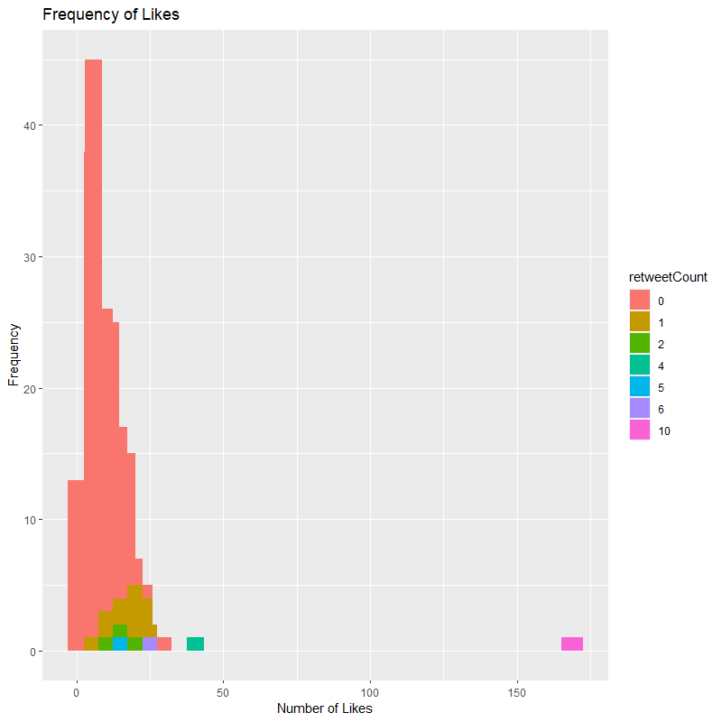
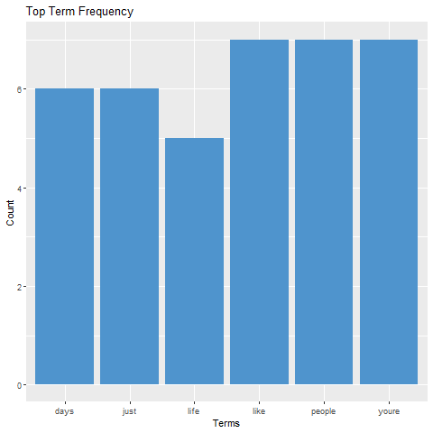
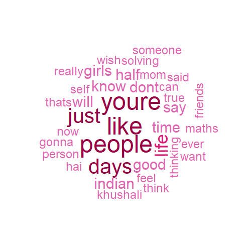

# Twt_tweet_analysis
This is a project I took up to learn more about text mining and exploratory data analysis. I would like to thank **milohoe** [@kosaalii](https://twitter.com/kosaalii) for letting me use her profile data for this project. This README documents all the progress as well as steps which one can follow to reproduce the results. 

## Dataset
Scraped from [Twitter](https://twitter.com/explore) using the [Twitter API](https://developer.twitter.com/en).

## Libraries used
- twitteR: To integrate Twitter API in R

- ggplot2: To make graphs aesthetically pleasing

- tm: To clean the text mined from twitter

- wordcloud: To make the wordcloud

## Files
- [`scripts/Oauth_access.R`](scripts/Oauth_access.R) This file helps to set up Oauth authorisation with Twitter API and also loads the libraries used in this project.
    
- [`scripts/getting_data.R`](scripts/getting_data.R) Gets the data from the Twitter API and stores it in a dataframe.

- [`scripts/text_cleaning.R`](scripts/text_cleaning.R) Cleans the tweets of elements not necessary for analysis.

- [`scripts/like_freq.R`](scripts/like_freq.R) Steps to make a histogram which shows the frequency of likes on tweets and corresponding retweets.

- [`scripts/top_term_freq.R`](scripts/top_term_freq.R) Steps to make a bar graph higlighting frequently used words.

- [`scripts/word_cloud.R`](scripts/word_cloud.R) Steps to make a wordcloud of the words used by user.

## Results 
### Frequency of Likes per tweet
The image shows the frequency of likes along with the number of retweets per tweet

### Most used terms
Here I plot the top words used more than 5 times by the user.

### Wordcloud
The wordcloud is made of the top terms used.

## To-Do
- [ ] Learn about Natural Language processing. 
- [ ] Learn sentiment analysis.
- [ ] Web Integration using Shiny.

## References
1. [Twitter Data Analysis with R](http://www.rdatamining.com/docs/twitter-analysis-with-r)

**Contributions are always welcome!** :smile:
